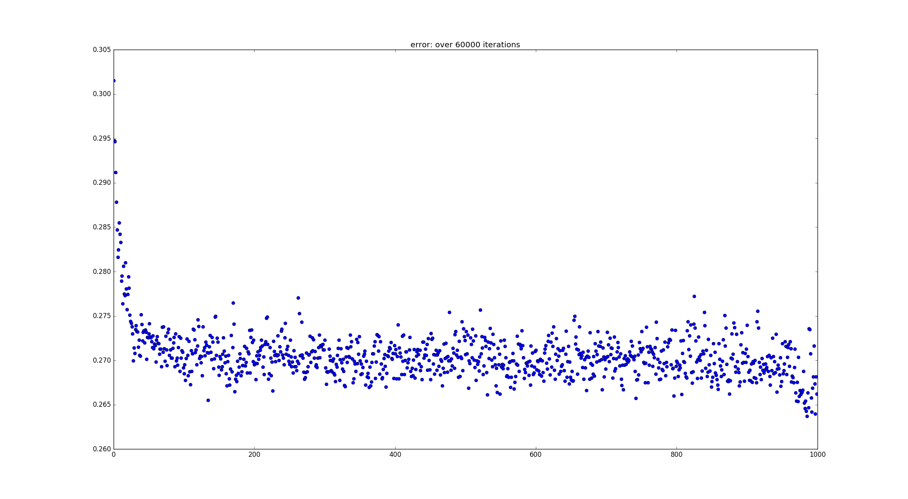
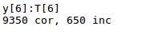

##Convolutional Neural Network
---

Fully GPU-based Convolutional Neural Network Implementation

Features : 

- Custom Matrix Library
	- [x] Basic Arithmetic
		- Follows Armadillo's operator conventions
	- [x] Automatic Memory Management
	- [x] Utility functions
	- [x] Random-fill
	- [ ] Shared Memory Optimization
	- [ ] __restrict__ Optimization
	- [ ] Save-Load Function
	- [ ] Optimize for non in-place calculations by setting output ptr

#Layers :
- [x] Activation Layer
	- [x] ReLU
	- [x] Sigmoid
	- [x] Softplus
	- [x] Tanh
	- [ ] Linear
- [x] Convolution Layer
	- [x] *SAME* Convolution
	- [ ] *VALID* Convolution
	- [ ] *FULL* Convolution
- [x] Dense Layer
- [ ] Dropout Layer
- [x] Flatten Layer
- [x] Pool Layer
- [x] Output Layer
	- [x] SoftMax
	- [ ] Linear

# TASKS

- [ ] Adaptive Learning Rate Optimizations
	- [ ] AdaDelta
	- [ ] AdaGrad
	- [ ] Adam
	- [ ] RMSProp
- [x] Momentum
	- [ ] Nesterov Momentum
- [ ] MiniBatch Gradient Descent
- [ ] Conv-Pool Layer for Speed
- [ ] Detecting End of Training
- [ ] Reimplement *DeConvolution* to work faster

# RESULTS

90% Accuracy on MNIST Data

Training Loss. The network doesn't improve since ~10000 iterations.

Final Collected Result
